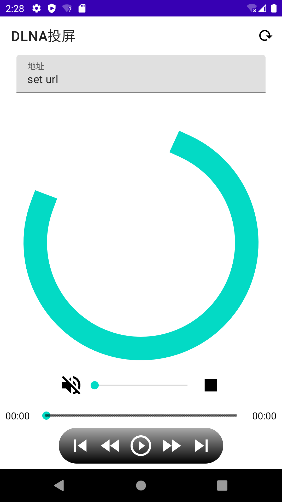

# Android 基于CyberGarage实现的DLNA投屏

## Preview



## How to use?

**Step 1.** Add the JitPack repository to your build file

```groovy
allprojects {
    repositories {
        ...
        maven { url 'https://jitpack.io' }
    }
}
```

**Step 2.** Add the dependency

```groovy
dependencies {
    implementation 'com.github.haotsang:Dlna-cast:Tag'
}
```

##  Proguard

If you are using R8 the shrinking and obfuscation rules are included automatically.

```groovy
#dlna
-dontwarn org.cybergarage.**
-keep class org.cybergarage.** {*;}
-keepattributes Annotation
```


